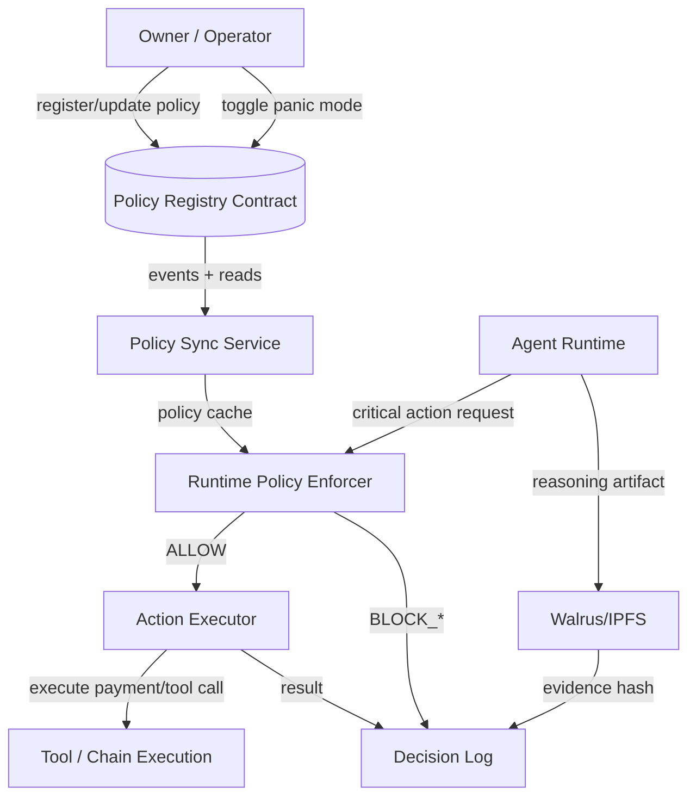
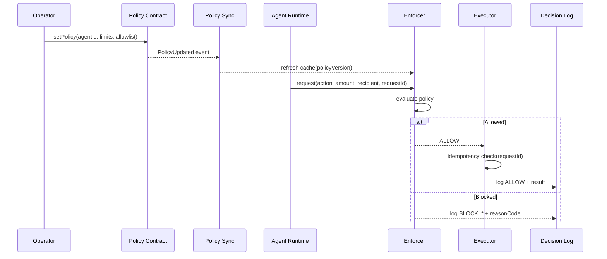

# ASK Architecture (MVP)

## 1) System Overview
Agent Survival Kit (ASK) is composed of four layers:

1. **Policy Layer (On-chain)**
   - Stores canonical policy per agent (limits, allowed actions, panic mode).
2. **Enforcement Layer (Runtime Middleware)**
   - Intercepts critical actions and evaluates against policy.
3. **Execution Layer (Agent + Tools)**
   - Executes allowed actions (payment/tool calls) with idempotency controls.
4. **Observability Layer (Logs + Evidence)**
   - Records allow/block decisions and links evidence hashes.

The key design principle is:
> Human controls policy; agent controls execution *within* policy.

---

## 2) Components

### A. Policy Registry Contract
- Stores `AgentPolicy` keyed by `agentId`
- Owner-only mutations
- Panic toggle and versioned policy updates
- Emits events:
  - `PolicyRegistered`
  - `PolicyUpdated`
  - `PanicModeChanged`

### B. Policy Sync Service (lightweight)
- Pulls latest policy from chain
- Maintains short-lived cache (`policyVersion`, `ttl`)
- Exposes policy to runtime middleware

### C. Runtime Policy Enforcer
- Hooks before critical action execution
- Evaluates:
  - panic mode
  - expiry
  - allowed action class
  - recipient constraints
  - rate/total spend limits
- Returns deterministic decision (`ALLOW` / `BLOCK_*`)

### D. Action Executor
- Executes only if enforcer returns `ALLOW`
- Uses `requestId` for idempotency
- Writes terminal result to action log

### E. Decision Log + Evidence Store
- Stores structured records:
  - requestId
  - decision
  - reasonCode
  - policyVersion
  - evidenceHash
- Evidence can be Walrus/IPFS hash; fallback hash marker if upload fails

### F. Operator Console / CLI
- Register/update policy
- Toggle panic mode
- Inspect latest blocked and allowed critical actions

---

## 3) Critical Flows

### Flow 1 — Normal Allowed Execution
1. Owner has active policy on-chain.
2. Agent receives action request.
3. Enforcer loads cached/latest policy.
4. Checks pass.
5. Executor performs action.
6. Decision + result logged with evidence hash.

### Flow 2 — Policy Violation Block
1. Agent receives out-of-policy request.
2. Enforcer detects violation (`BLOCK_*`).
3. Action is not executed.
4. Block event logged with reason code.

### Flow 3 — Panic Mode
1. Owner toggles panic mode on-chain.
2. Sync service updates cache.
3. Any new high-risk action gets `BLOCK_PANIC_MODE_ACTIVE`.
4. Read-only actions may still be allowed (configurable).

---

## 4) Mermaid — Component Diagram

---

## 5) Mermaid — Sequence (Allowed vs Blocked)

---

## 6) Policy Evaluation Order (Deterministic)
1. Policy available?
2. Panic mode active?
3. Policy expired?
4. Action class allowed?
5. Recipient allowed?
6. Rate limit check
7. Total limit check
8. Return `ALLOW`

This order keeps behavior predictable and easy to audit.

---

## 7) Failure & Fallback Strategy
- **Policy sync failure**: use cached policy until TTL
- **Cache expired for high-risk action**: fail-closed (`BLOCK_POLICY_UNAVAILABLE_FAIL_CLOSED`)
- **Evidence upload failure**: attach fallback hash marker; do not silently skip log
- **Executor timeout**: mark action failed with timeout reason, keep trace

---

## 8) Security Notes (MVP)
- Owner-only policy mutation
- Strict reason-coded blocks
- No execution when policy state is uncertain (high-risk)
- Idempotent execution to prevent duplicate side effects
- Minimal trusted surface: contract + enforcer + executor

---

## 9) Open Implementation Decisions
- Chain choice for MVP (Base Sepolia vs Sui testnet)
- Action classes in v1 (recommended: `spend`, `exec`, `external_send`)
- Recipient allowlist strict-by-default vs optional
- Cache TTL (recommended: 30–60s)
