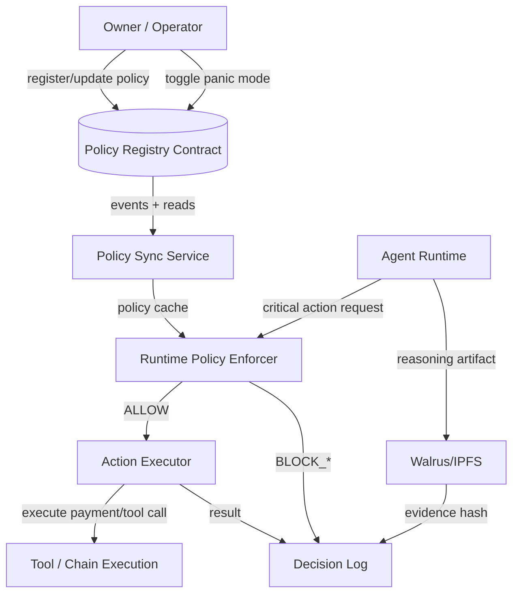

# Agent Survival Kit (ASK)

**Cloudflare for AI agents** — policy-enforced autonomy with emergency controls and auditability.

ASK is a safety layer for autonomous agents (e.g., OpenClaw-based agents). It combines **on-chain policy control** with **runtime enforcement** so agents can execute useful work without ever having unrestricted authority over funds or sensitive actions.

---

## Why ASK?

As agent autonomy increases, so does operational risk:
- Prompt injection and instruction hijacking
- Unbounded treasury spending
- Unsafe tool execution
- No universal panic switch
- Weak post-incident forensics

ASK solves this by separating:
- **Policy sovereignty (human owner)**
- **Execution autonomy (agent runtime)**

The agent can move fast, but only inside explicit, verifiable boundaries.

---

## Core Features (MVP)

1. **On-chain Policy Registry**
   - Register and update policy per `agentId`
   - Owner-only mutation
   - Versioned policy updates

2. **Runtime Policy Enforcer**
   - Intercepts critical actions before execution
   - Deterministic allow/block decisions with reason codes

3. **Panic Mode (Emergency Kill Switch)**
   - Owner can toggle `panicMode` on-chain
   - Runtime immediately blocks high-risk actions

4. **Decision Logging + Evidence References**
   - Every critical decision is logged (allow/block)
   - Includes policy version, reason code, and evidence hash

---

## High-Level Architecture



> Full details: see [`ARCHITECTURE.md`](./ARCHITECTURE.md)

---

## Policy Model (MVP)

Example policy fields:
- `owner`
- `spendLimitTotal`
- `spendRateLimit`
- `allowedActions`
- `allowedRecipients` (optional)
- `riskLevel`
- `expiresAt`
- `panicMode`

---

## Decision Model

Runtime returns one of:
- `ALLOW`
- `BLOCK_POLICY_VIOLATION`
- `BLOCK_PANIC_MODE`
- `BLOCK_POLICY_UNAVAILABLE` (fail-closed for high-risk paths)

Example reason codes:
- `ALLOW_WITHIN_POLICY`
- `BLOCK_ACTION_NOT_ALLOWED`
- `BLOCK_RECIPIENT_NOT_ALLOWED`
- `BLOCK_SPEND_RATE_EXCEEDED`
- `BLOCK_SPEND_TOTAL_EXCEEDED`
- `BLOCK_POLICY_EXPIRED`
- `BLOCK_PANIC_MODE_ACTIVE`
- `BLOCK_POLICY_UNAVAILABLE_FAIL_CLOSED`

---

## Demo Flow (2–3 minutes)

1. Register policy on-chain (`maxTotal`, `rateLimit`, `allowlist`)
2. Execute valid action (allowed)
3. Attempt out-of-policy action (blocked)
4. Toggle panic mode on-chain
5. Attempt another high-risk action (blocked by panic)
6. Show decision logs + on-chain evidence

---

## Repository Structure

```text
synthesis/
├── README.md
├── ASK-PRD.md
├── ARCHITECTURE.md
├── MVP_TASKS.md
├── contracts/
├── runtime/
├── api/
├── docs/
└── demo/
```

---

## Quick Start (Planned)

> Implementation scaffolding is in progress. This README defines MVP behavior and architecture.

### 1) Configure environment
Create `.env` from `.env.example`:
- `RPC_URL`
- `PRIVATE_KEY` (deployer)
- `POLICY_REGISTRY_ADDRESS` (after deploy)
- `EVIDENCE_BACKEND` (`walrus` / `ipfs`)

### 2) Deploy policy contract
- Deploy `PolicyRegistry`
- Save deployed address to `docs/DEPLOYMENTS.md`

### 3) Run runtime enforcer
- Start policy sync service
- Start agent runtime middleware

### 4) Run demo script
- Create policy
- Execute valid request
- Execute violating request
- Toggle panic mode
- Re-test and inspect logs

---

## Security Principles

- Least privilege by default
- Time-bounded authority
- Deterministic policy checks
- Fail-closed on uncertain policy state (high risk)
- Structured incident logs for postmortems

---

## Hackathon Fit

ASK aligns with Synthesis themes:
- **Agents that pay**: bounded spending controls
- **Agents that trust**: verifiable policy + auditability
- **Agents that cooperate**: enforceable operational boundaries

This project is intentionally scoped to ship a working, testable MVP fast.

---

## Current Status

- [x] PRD drafted
- [x] Architecture spec drafted
- [x] 72-hour MVP plan drafted
- [ ] Contract implementation
- [ ] Runtime enforcer implementation
- [ ] End-to-end demo + video

---

## Contributing

If you want to collaborate:
1. Open an issue describing scope and expected behavior.
2. Keep changes deterministic and security-first.
3. Include test coverage for policy decision logic.

---

## License

TBD (suggestion: MIT)
